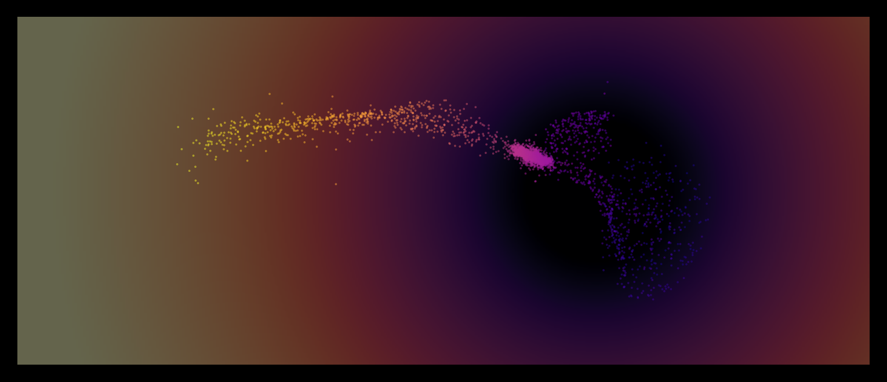

# Borrowed Models & Synthetic Pre-Training: Efficient Alternatives to Domain-Specific Foundation Models

**Jianhao Wu**<sup>1,†</sup> [](https://orcid.org/0009-0000-7431-7885) · **Mariel Pettee**<sup>1,2</sup> [](https://orcid.org/0000-0001-9208-3218)

<sup>1</sup> Department of Physics, University of Wisconsin–Madison, Madison, Wisconsin, USA    
<sup>2</sup> Data Science Institute, University of Wisconsin–Madison, Madison, Wisconsin, USA   
<sup>†</sup> Corresponding author: [jianhao.wu@wisc.edu](mailto:jianhao.wu@wisc.edu) (J.W.)


Astrophysicists cannot always find suitable in-domain foundation models to accelerate their model training. Then there can be two ways: **to borrow** foundation models from other physics domains like high energy physics, or **to pre-train light-weighted** foundation models with synthetic datasets like geometry shapes.

Can both ways work (at least better than from scratch)? Which one should be our preference? We answered these two questions by a simple stellar stream benchmark task in astrophysics: using the final spatial positions of stars, to infer the initial progenitor mass of the stellar stream.

<p align="center">
  
  <br>
  <em>2D projection of a stellar stream within Milky Way potential</em>
</p>

---
## Repo Overview

This repo covers three parts: 
- the scripts to reproduce and post-process both the stream simulations and the geometry datasets
- the scripts to train the geometry pre-trained models, fine-tune and evaluate different models on the same test set.
- the scripts to generate the figures shown in the paper, including the $R^2$ comparison among different models, the visualization for different geometry shapes, and other visualization figures.

For the main $R^2$ comparison figure, we also include a jupyter notebook for quick reproduction: this jupyter notebook can be run without running the training scripts by yourself, since we have uploaded the training result cache files to this repo, too.

### Installation
Firstly, create a conda environment and install the basic packages besides those associated with OmniLearned:
```
module load conda
mamba create -n stream_transfer_learning python=3.11
mamba activate stream_transfer_learning
pip install -e .
python -m ipykernel install --user --name stream_transfer_learning --display-name stream_transfer_learning # For using interactive jupyter notebook
```

Secondly, download the OmniLearned package and also install its dependencies:
```
git clone https://github.com/ViniciusMikuni/OmniLearned.git
cd OmniLearned
pip install -e .
```

Thirdly, load the texlive module before generating figures:
```
module load texlive/2024
```

[Optional] Modify the OmniLearned src code to include "streams" dataset type, if you want to re-run the training scripts!  

## Reproduction of stream simulations & geometry datasets

### Stream Simulations

```
cd /path/to/Stream_Transfer_Learning
cd scripts
NUM_STREAMS_LIST="300 1000 10000" bash prepare_raw_data_submission.sh
```

### Geometry datasets

Firstly, to generate the original 7 datasets (6 geometry shapes + 1 stream eigenvalue dataset adapted from the stream simulations):
```
cd /path/to/Stream_Transfer_Learning
cd scripts
DATASET_SIZES="10000" bash prepare_data_proxy_pretrain.sh
```

However, some may have in total 3 targets while some only have 1 target. To be consistent, we adopted the long axis of the anisotropic shapes as the only regression target:
```
cd /path/to/Stream_Transfer_Learning
mamba activate stream_transfer_learning
python src/make_ellipsoid_sigmax_from_ellipsoid.py
python src/make_bounded_ellipsoid_a_from_hard_ellipsoid.py
python src/make_box_a_from_box.py
python src/make_eigen_lambda1_from_eigenvalues.py
```

## Pre-training the geometry models & fine-tuning and evaluating all the models.

### Pre-training the geometry models

```
cd /path/to/Stream_Transfer_Learning
for proxy in 3d_proxy_cube 3d_proxy_bounded_ball 3d_proxy_gaussian_ball 3d_proxy_gaussian_ellipsoid_sigmax 3d_proxy_bounded_ellipsoid_a 3d_proxy_box_a 3d_x_y_z_eigenvalues_lambda1; do
    TARGET_COLUMN="$proxy" bash scripts/stream_1x4/run_omnilearned_proxy_pretrain_1x4_submission.sh
done
```
### Fine-tuning and evaluating models

#### Fine-tuning the geometry pre-trained models

```
cd /path/to/Stream_Transfer_Learning
for proxy in cube bounded_ball gaussian_ball gaussian_ellipsoid_sigmax bounded_ellipsoid_a box_a eigen_lambda1; do
    pretrain_dir="3d_proxy_${proxy}_10000"
    [[ "$proxy" == "eigen_lambda1" ]] && pretrain_dir="3d_x_y_z_eigenvalues_lambda1_10000"
    ckpt="$(pwd)/${pretrain_dir}/omnilearned_proxy_pretrain_1x4/run_0/best_model_.pt"

    for s in 300 1000 10000; do
        PROXY_DATASET="$proxy" PRETRAIN_CKPT="$ckpt" DATASET_SIZE="$s" bash scripts/stream_1x4/run_omnilearned_proxy_finetune_1x4_submission.sh
    done
done
```

#### Other Deep Learning models (scratch and physics pre-trained models)
```
cd /path/to/Stream_Transfer_Learning
for s in 300 1000 10000; do
    # DeepSets baseline
    DATASET_SIZE="$s" bash scripts/run_baseline_256_submission.sh

    # OmniLearned from scratch
    DATASET_SIZE="$s" bash scripts/stream_1x4/run_omnilearned_scratch_1x4_submission.sh
    
    # OmniLearned physics pre-trained models
    ## Jet physics
    DATASET_SIZE="$s" bash scripts/stream_1x4/run_omnilearned_finetune_1x4_submission.sh
    ## Cosmology (from OmniCosmos)
    PRETRAIN_SOURCE=camels  DATASET_SIZE="$s" bash scripts/stream_1x4/run_omnicosmos_finetune_1x4_submission.sh
    PRETRAIN_SOURCE=quijote DATASET_SIZE="$s" bash scripts/stream_1x4/run_omnicosmos_finetune_1x4_submission.sh
done
```

#### Evaluation and non-DL baselines

- The above fine-tuning by default would use the last 20% streams as test, so we need to manually switch the evaluation to the same 2000 streams.
  ```
  cd /path/to/Stream_Transfer_Learning
  bash scripts/eval_shared_test10000.sh 
  ```
- Two non-DL baselines with no training needed, can just evaluate: average (would not show up in R2 result figure since that would be just zero) + eigenvalue_regression
  ```
  cd /path/to/Stream_Transfer_Learning
  bash scripts/eval_shared_test10000_nonML.sh
  ```
- We would get the scatter across the three runs from training directly, but for the estimation of bootstrap uncertainty we need to calculate it for all the models by:
  ```
  cd /path/to/Stream_Transfer_Learning
  bash scripts/compute_bootstrap_shared_test_all.sh
  ```

## Generation of the figures

Only the $R^2$ figure (along with its zoom version) can be generated without downloading additional datasets! See [reproduce_main_figure.ipynb](evaluation/reproduce_main_figure.ipynb) for quick, interactive view!

For command lines/scripts approach, see below

### $R^2$ among all the models
The main figure (and a table tex file) can be generated with:
```
cd /path/to/Stream_Transfer_Learning
bash evaluation/results_3d_shared_test10000.sh
```

For zoom version:
```
cd /path/to/Stream_Transfer_Learning
R2_YMIN=0.8 LATEX_TABLE=false bash evaluation/results_3d_shared_test10000.sh
```

### Gallery for geometry datasets

- To generate the combined figure including the 6 geometry shapes:
```
cd /path/to/Stream_Transfer_Learning
python src/proxy_gallery.py --proxy_type combined
```

- To also generate the separate figures for 6 shapes and the stream eigenvalue dataset, along with the geometry combined figure:
```
cd /path/to/Stream_Transfer_Learning
python src/proxy_gallery.py --proxy_type all --input_raw raw_data/prog_mass_reg_dataset_10000.h5
```
--input_raw is required if the stream eigenvalue dataset is included (--proxy_type [eigen or all])

### Other visualization figures

- The progenitor mass vs stream eigenvalues
```
cd /path/to/Stream_Transfer_Learning
cd visualization
python ../src/visualization.py --input_raw ../raw_data/prog_mass_reg_dataset_10000.h5 --plot_scaling
```

- The rendering image for one single stream inside MW
```
cd /path/to/Stream_Transfer_Learning
cd visualization
python ../src/visualization.py --input_raw ../raw_data/prog_mass_reg_dataset_10000.h5 --plot_stream_beauty --beauty_mw_potential --beauty_planes xy
```